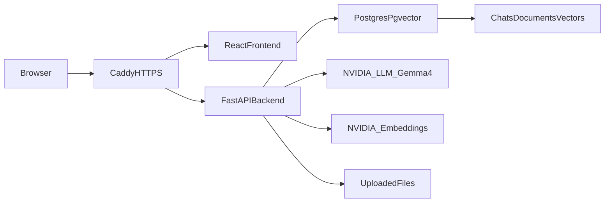

# AI Test Platform Design

## Purpose

Build a private test platform for evaluating AI integration inside a company. The platform lets a shared test group sign in with one pre-created account, upload company documents, ask questions in a chat interface, and compare normal LLM responses with document-grounded RAG responses.

The first version is a VPS-deployed MVP. It should be simple to operate, but structured so it can later grow into a multi-user internal AI platform.

## Scope

### In Scope

- Docker Compose deployment on a VPS.
- HTTPS and reverse proxy with Caddy.
- React frontend.
- FastAPI backend.
- Postgres with `pgvector` for relational data and vector search.
- One DB-backed test user with no public registration.
- Shared chat history and shared uploaded documents for the test account.
- Upload support for `PDF`, `DOCX`, `TXT`, and `MD` files.
- Document parsing, chunking, embedding, and vector storage.
- NVIDIA API integration for one embedding model and one Gemma 4 LLM model.
- Chat modes for normal LLM chat and RAG over uploaded documents.
- Response style controls: concise, detailed, and expert.
- Document indexing statuses and user-visible failure messages.
- Backend, frontend, and Docker Compose smoke tests.

### Out of Scope For MVP

- Public registration.
- Multiple users, roles, or per-user permissions.
- Billing, quotas, or organization management.
- Advanced admin dashboard.
- Distributed task queue such as Celery or Redis Queue.
- Fine-tuning or local model hosting.
- Multi-tenant isolation.

## Architecture

The system uses four long-running containers on the VPS:

- `caddy`: public entrypoint, HTTPS termination, and reverse proxy.
- `frontend`: React application served as a web UI.
- `backend`: FastAPI application for auth, documents, chat, and RAG.
- `postgres`: Postgres image with `pgvector` enabled.

Uploaded source files are stored in a persistent Docker volume mounted by the backend. Structured metadata, chat history, document chunks, and embeddings are stored in Postgres.

## Deployment Design

Deployment targets one VPS running Docker and Docker Compose. The repository will include production-oriented Compose files and examples, while real secrets stay only on the server.

Expected deployment files:

- `docker-compose.yml` for service definitions.
- `Caddyfile` for domain routing and automatic HTTPS.
- `.env.example` for required environment variables.
- Deployment documentation with setup, update, backup, and restore commands.

Caddy routes public traffic:

- `/` serves the React frontend.
- `/api/*` proxies to FastAPI.

Caddy manages Let's Encrypt certificates using the configured domain and email. The MVP assumes a single domain points to the VPS.

## Configuration

Runtime configuration comes from environment variables:

- `APP_DOMAIN`: public domain used by Caddy and frontend API configuration.
- `LETSENCRYPT_EMAIL`: email for certificate registration.
- `POSTGRES_DB`, `POSTGRES_USER`, `POSTGRES_PASSWORD`: database settings.
- `DATABASE_URL`: backend database connection string.
- `JWT_SECRET`: signing secret for auth tokens.
- `INITIAL_USER_USERNAME`: username for the seeded test user.
- `INITIAL_USER_PASSWORD`: initial password for the seeded test user.
- `NVIDIA_API_KEY`: API key for NVIDIA-hosted models.
- `NVIDIA_EMBEDDING_MODEL`: embedding model identifier.
- `NVIDIA_LLM_MODEL`: Gemma 4 LLM model identifier.
- `UPLOAD_MAX_MB`: maximum uploaded document size.
- `RAG_TOP_K`: number of document chunks retrieved for each RAG answer.

The repository must not contain real secrets. Only `.env.example` is committed.

## Authentication

The site opens directly on the login screen. Registration is not available.

A single test user is created in Postgres by the first backend startup if no user exists. The password is stored as a secure hash, not plaintext. After successful login, the backend issues a signed JWT stored in an HTTP-only cookie.

All application data is associated with the shared test account. Because the test group signs in as the same user, every tester sees the same documents and chat history.

## Data Model

The MVP data model includes these core entities:

- `users`: one seeded test user, with username and password hash.
- `chat_sessions`: named chat threads for the shared account.
- `chat_messages`: ordered user and assistant messages.
- `documents`: uploaded file metadata, status, and error messages.
- `document_chunks`: extracted text chunks and chunk metadata.
- `document_embeddings`: vector embeddings for chunks, stored with `pgvector`.

Document statuses:

- `uploaded`: file saved and queued for processing.
- `processing`: parser, chunker, or embedding calls are running.
- `ready`: chunks and embeddings are stored and searchable.
- `failed`: processing failed; a short user-facing error is available.

## Document Processing

The upload flow supports `PDF`, `DOCX`, `TXT`, and `MD`.

1. The user uploads a file in the sidebar.
2. The backend validates size and extension.
3. The backend stores the original file in persistent storage.
4. A document row is created with status `uploaded`.
5. A background task updates status to `processing`.
6. Text is extracted using file-type specific parsers.
7. Text is split into chunks with stable metadata.
8. Each chunk is sent to the NVIDIA embedding model.
9. Chunk text and vectors are stored in Postgres.
10. The document status becomes `ready`.

For MVP scale, document indexing runs as a FastAPI-managed background task in the backend process. A separate Redis/Celery worker is intentionally deferred until document volume or processing time requires it.

## Chat And RAG Flow

The chat screen supports two answer modes:

- `normal`: send the user message directly to the configured Gemma 4 LLM with the selected response style.
- `rag`: embed the user question, retrieve relevant document chunks with `pgvector`, include those chunks in the prompt, then call the Gemma 4 LLM.

RAG flow:

1. User sends a message in a chat session.
2. Backend saves the user message.
3. Backend creates an embedding for the question with `NVIDIA_EMBEDDING_MODEL`.
4. Backend retrieves the nearest ready document chunks from Postgres.
5. Backend builds a prompt with system instructions, selected style, question, and retrieved context.
6. Backend calls `NVIDIA_LLM_MODEL`.
7. Backend saves the assistant response and source references.
8. Frontend displays the answer and, when available, the source document names.

If no relevant chunks are found in RAG mode, the assistant must say that the uploaded documents do not contain enough context and ask the user to upload more relevant material or switch to normal chat. It must not silently fall back to an ungrounded answer in RAG mode.

## User Interface

The UI has two states: unauthenticated login and authenticated chat workspace.

The login screen is the first page users see. It contains only the username/password form and a clear error message for failed login.

After login, the workspace layout is:

- Left sidebar:
  - platform name;
  - new chat button;
  - shared chat history;
  - document upload control;
  - document list with statuses.
- Main area:
  - mode buttons for normal chat and RAG;
  - response style buttons for concise, detailed, and expert;
  - current model indicator for Gemma 4 via NVIDIA API;
  - message history;
  - text input and send button.

The approved wireframe places chat history and document controls together in the left sidebar, with the conversation and mode controls in the main panel.

## Error Handling And Logging

The frontend should show concise, actionable messages:

- invalid login;
- unsupported file type;
- upload too large;
- document processing failed;
- NVIDIA API request failed;
- chat response failed.

Backend logs should be structured and include request IDs where practical. Logs must not include raw passwords, API keys, or full secret values.

Document processing failures are persisted on the `documents` row with status `failed` and a short safe error message. Detailed stack traces remain in backend logs.

## Security Considerations

The MVP is a test platform, but it still handles company documents. Minimum safeguards:

- HTTPS only through Caddy.
- HTTP-only auth cookie.
- Password hashing for the seeded user.
- No public registration.
- Secrets only in server-side `.env`.
- Upload validation by extension and size.
- No API keys exposed to the frontend.
- Backend CORS restricted to the configured domain.

The shared account is acceptable for MVP testing but not for production use with sensitive audit requirements.

## Testing Strategy

Backend tests:

- login success and failure;
- authenticated and unauthenticated API access;
- document upload validation;
- text extraction for supported file types;
- chunking behavior;
- vector search query path;
- normal chat request path;
- RAG chat request path with mocked NVIDIA APIs.

Frontend tests:

- login form behavior;
- authenticated layout renders sidebar and chat;
- document upload status display;
- chat mode and response style controls;
- message send flow with mocked API responses.

Deployment smoke tests:

- Docker Compose builds and starts all services.
- Caddy routes frontend and `/api` correctly.
- Backend can connect to Postgres.
- `pgvector` extension is available.
- Seeded test user can log in.

## Operations

The deployment documentation includes:

- VPS prerequisites;
- DNS and domain setup;
- `.env` creation from `.env.example`;
- first deploy command;
- update command;
- log inspection commands;
- Postgres backup command;
- Postgres restore command;
- basic troubleshooting for Caddy certificates and NVIDIA API failures.

Postgres data and uploaded files live in named Docker volumes so application updates do not delete user data.

## Future Extensions

Likely next steps after MVP:

- individual users and roles;
- separate chat history per user;
- admin document management;
- Redis/Celery worker for indexing;
- richer source citations;
- configurable prompts per department;
- analytics on usage and answer quality;
- additional NVIDIA-hosted models.

## Acceptance Criteria

The MVP design is implemented when:

- A user can open the domain and sees the login screen first.
- The seeded DB user can log in.
- The authenticated workspace shows shared chat history, document upload, document statuses, and chat controls.
- A supported document can be uploaded and indexed into `pgvector`.
- Normal chat mode can call the configured Gemma 4 model.
- RAG mode retrieves document chunks and uses them in a Gemma 4 answer.
- Errors in upload, indexing, and model calls are visible without exposing secrets.
- The stack runs through Docker Compose on a VPS behind Caddy HTTPS.
- Tests and smoke checks cover the main auth, upload, RAG, chat, and deployment paths.
